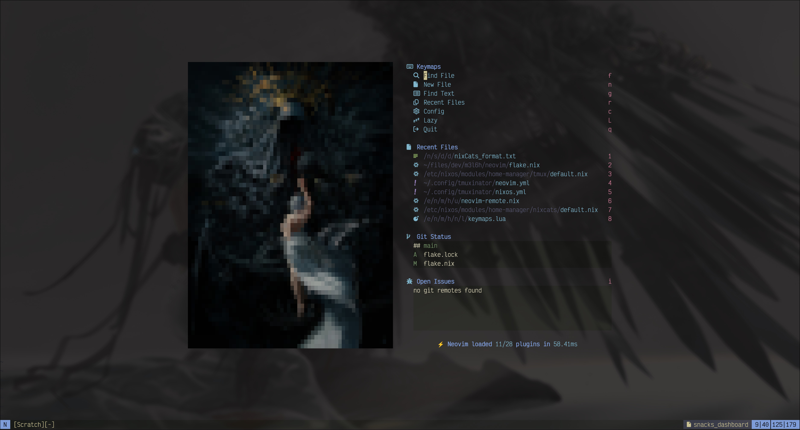

# dotfiles-neovim

My personal Neovim configuration put together using
[nixCats](https://nixcats.org)
with
[lazy](https://lazy.folke.io)
so that it is portable between Nix and non-Nix environments.



<!-- START doctoc generated TOC please keep comment here to allow auto update -->
<!-- DON'T EDIT THIS SECTION, INSTEAD RE-RUN doctoc TO UPDATE -->
**Table of Contents**

  - [Options](#options)
    - [Language options](#language-options)
  - [Dependencies](#dependencies)
  - [Language servers](#language-servers)
  - [Development](#development)
    - [Debugging](#debugging)
- [Credits](#credits)

<!-- END doctoc generated TOC please keep comment here to allow auto update -->

## Options

Available config options.

| Option | Purpose |
| - | - |
| `vim.g.border` | Specify the border to use across floats |
| `vim.g.dashboard.image` | Specify the image to display on the dashboard |
| `vim.g.dashboard.size` | Size of the dashboard image to pass to chafa |
| `vim.g.feat.image` | Enable/disable image preview via Snacks |
| `vim.g.langs.*` | Indvidually enable/disable language toolchains |
| `vim.g.plugins.*` | Indvidually enable/disable plugins |
| `vim.g.terminalwindow` | Specify the tmux window vim should switch to when "closing" |

### Language options

Each option listed is a Boolean flag which toggles the corresponding language features on or off.

| Option |
| - |
| vim.g.langs.lua |
| vim.g.langs.markdown |
| vim.g.langs.nix |
| vim.g.langs.python |
| vim.g.langs.rust |
| vim.g.langs.shell |
| vim.g.langs.web |
| vim.g.langs.yaml |

## Dependencies

Dependencies that are used by the various plugins in the configuration. On Nix, these are included
in the flake and will be installed automatically. On non-Nix systems, these will have to be
installed manually.

Each dependency below has been prefixed by the nixCats category it is associated with.

| Dependency | Purpose |
| - | - |
| dashboard:chafa | Used for image in dashboard |
| dashboard:gh | Used for GitHub issues in dashboard |
| dashboard:image-magick | Used for image in dashboard |
| image:ghostscript | Used to render pdf files |
| image:imagemagick | Used to convert image formats for rendering |
| image:mermaid-cli | Used to render mermaid diagrams |
| image:tectonic | Used to render LaTeX expressions |
| lua:lua-language-server | Used for lua language support |
| lua:stylua | Used for lua formatting |
| markdown:doctoc | Used for generating table of contents in Markdown files |
| markdown:marksman | Language server for Markdown |
| markdown:mdformat | Used for formatting Markdown |
| markdown:mdsf | Used for formatting code blocks in Markdown |
| nix:nixd | Language server for nix |
| nix:nixfmt-rfc-style | Used for nix formatting |
| picker:fzf | Used in picker |
| picker:ripgrep | Used in picker |
| python:basedpyright | Language server for Python |
| python:ruff | Linter and formatter for Python |
| rust:rust-analyzer | Language server for Rust |
| rust:rustfmt | Fromatter for Rust |
| shell:bash-language-server | Language server for Shell scripts |
| shell:shellcheck | Linter for Shell scripts |
| shell:shfmt | Used to format Shell scripts |
| web:emmet-language-server | Specialized language server to make writing HTML & CSS easier |
| web:prettierd | Used to format various web files files |
| web:stylelint | Used to lint CSS files |
| web:typescript-language-server | Language server for JavaScript/TypeScript |
| web:vscode-languagservers-extracted | Language server for CSS & eslint |

## Language servers

Language server configuration is centralized at
[lspconfig.lua](lua/plugins/lspconfig.lua)
under the lsps table. To add more lsps, a new entry should be added to the lsps table, and the
required dependencies should be added to the corresponding category in
[flake.nix](flake.nix)
.

## Development

Make any changes to the appropriate files, then run

```sh
nix build .
```

### Debugging

Check the flake interactively with:

```sh
nix repl --expr "builtins.getFlake \"$PWD\""
```

# Credits

In no particular order.

- [Mr. Jakob](https://www.youtube.com/@MrJakob)
- [nixCats](https://nixcats.org)
