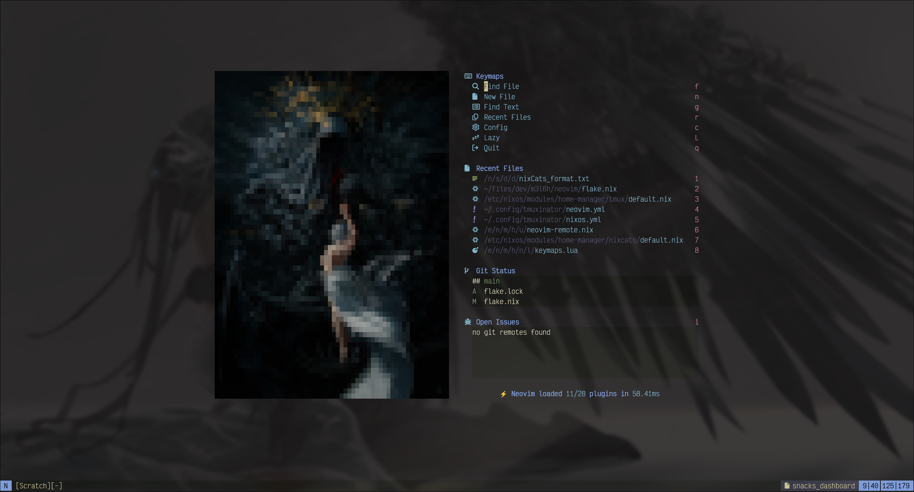

# neovim

My personal neovim configuration put together using
[nixCats](https://nixcats.org)
with
[lazy](https://lazy.folke.io)
so that it is portable between Nix and non-Nix environments.



## Options

Available config options.

| Option                  | Purpose                                                     |
| ----------------------- | ----------------------------------------------------------- |
| `vim.g.border`          | Specify the border to use across floats                     |
| `vim.g.dashboard.image` | Specify the image to display on the dashboard               |
| `vim.g.dashboard.size`  | Size of the dashboard image to pass to chafa                |
| `vim.g.terminalwindow`  | Specify the tmux window vim should switch to when "closing" |


## Dependencies

Dependencies that are used by the various plugins in the configuration. On Nix, these are included
in the flake and will be installed automatically. On non-Nix systems, these will have to be
installed manually.

Each dependency below has been prefixed by the nixCats category it is associated with.

| Dependency              | Purpose                             |
| ----------------------- | ----------------------------------- |
| dashboard:chafa         | Used for image in dashboard         |
| dashboard:gh            | Used for GitHub issues in dashboard |
| dashboard:image-magick  | Used for image in dashboard         |
| lua:lua-language-server | Used for lua language support       |
| lua:stylua              | Used for lua formatting             |
| nix:nixd                | Used for nix language support       |
| nix:nixfmt-rfc-style    | Used for nix formatting             |
| picker:fzf              | Used in picker                      |
| picker:ripgrep          | Used in picker                      |

## Language servers

Language server configuration is centralized at
[lspconfig.lua](lua/plugins/lspconfig.lua)
under the lsps table. To add more lsps, a new entry should be added to the lsps table, and the
required dependencies should be added to the corresponding category in
[flake.nix](flake.nix)
.

## Development

Make any changes to the appropriate files, then run

```sh
nix build .
```

# Credits

In no particular order.

- [Mr. Jakob](https://www.youtube.com/@MrJakob)
- [nixCats](https://nixcats.org)
